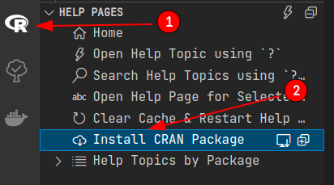
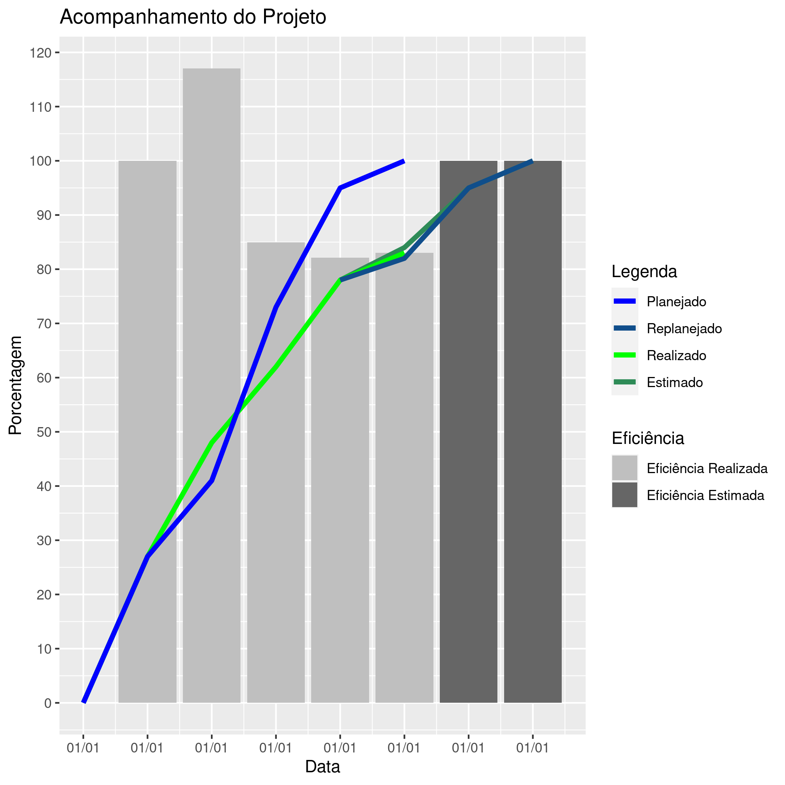

# bir_tracking-project

This repository creates a graph for project tracking. 

**Keywords**: Project, Follow-up

**Author**: [Mateus Seixas](https://github.com/seixasxbr), [Anderson Lima](https://github.com/aldenpower)

**Affiliation**: [BIR - Brazilian Institute of Robotics](https://github.comBrazilian-Institute-of-Robotics)  
**Maintainer**: [Mateus Seixas](https://github.com/seixasxbr), [Anderson Lima](https://github.com/aldenpower)

_For more details visit_ [RASC](https://www.braziliansinrobotics.com/)

## Installation on Visual Studio Code

1 - Install R extension on VS code

_After the installation confirm the installation of the r language server_

2 - Open the R extension menu and install the packages listed below

- ggplot2
- config
- tikzDevice

_Clone this repository_

3 - git clone https://github.com/Brazilian-Institute-of-Robotics/bir_tracking-project.git

4 - Enter in the repository directory

_Now you can edit the config.yml file for your needs or simple run as default configuration_

5 - Run the script **acompanhamento.R**

_The graph generated_

_At the resources folder there is the LaTex figure **graph.text** code generated and the **graph.png** figure
